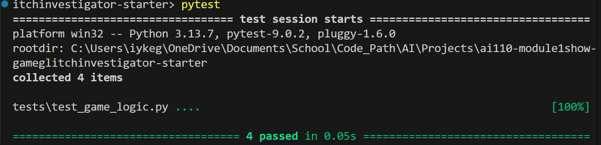

# 🎮 Game Glitch Investigator: The Impossible Guesser

## 🚨 The Situation

You asked an AI to build a simple "Number Guessing Game" using Streamlit.
It wrote the code, ran away, and now the game is unplayable. 

- You can't win.
- The hints lie to you.
- The secret number seems to have commitment issues.

## 🛠️ Setup

1. Install dependencies: `pip install -r requirements.txt`
2. Run the broken app: `python -m streamlit run app.py`

## 🕵️‍♂️ Your Mission

1. **Play the game.** Open the "Developer Debug Info" tab in the app to see the secret number. Try to win.
2. **Find the State Bug.** Why does the secret number change every time you click "Submit"? Ask ChatGPT: *"How do I keep a variable from resetting in Streamlit when I click a button?"*
3. **Fix the Logic.** The hints ("Higher/Lower") are wrong. Fix them.
4. **Refactor & Test.** - Move the logic into `logic_utils.py`.
   - Run `pytest` in your terminal.
   - Keep fixing until all tests pass!

## 📝 Document Your Experience

- [ ] Describe the game's purpose.
It's a Number Guessing Game where players try to find a randomly selected secret number within a range (difficulty/level based) earning or losing points based on how quickly they succeed before running out of attempts.
- [ ] Detail which bugs you found.
1. Enter button didn't work—"Press Enter to apply" displayed but pressing Enter did nothing.
2. "Out of attempts" message appeared prematurely when users still had guesses remaining due to an off-by-one error in attempt counting.
3. Attempts counter wasn't updating on first form submission, only showing the change on the second click due to stale widget state.
- [ ] Explain what fixes you applied.
Wrapped the text input and submit button in a Streamlit form using st.form("guess_form") and changed the button to st.form_submit_button(), which now allows pressing Enter to automatically submit the guess instead of requiring a button click.I corrected the attempts counter bug by changing the initial attempts from 1 to 0 and adding an early check. To fix the stale widget state issue, I added st.session_state.attempts to the text input key and called st.rerun() after submission to clear the form state and update the display immediately on the first Enter press.

## 📸 Demo

## 🚀 Stretch Features

- [ ] [If you choose to complete Challenge 4, insert a screenshot of your Enhanced Game UI here]
